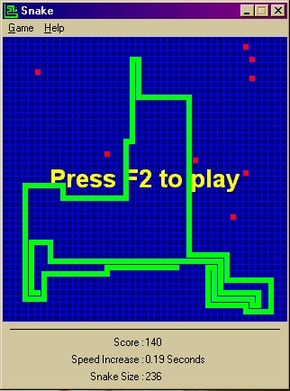



## Snake Game With Demo AI

### Description

NOT a beginners code I'm afraid. The game code itself is really intermediatary/beginner, but the graphics code uses a lot of api calls. The demo ai is fairly simple, but it's managed to get a top score so far of 240. My current best is a measly 170. Fully customisable, including play-area size, player starting and finishing speeds, ai speed (you can let it cheat). Oh yeah, please note that the ai enters it's own score unless you set it not to :) Any comments are welcome (so are any votes). Enjoy the code and feel free to use or distribute it.
 
### More Info
 

             |
---                |---
**Submitted On**   |2001-12-06 16:52:42
**By**             |[Eric O'Sullivan](https://github.com/Planet-Source-Code/PSCIndex/blob/master/ByAuthor/eric-o-sullivan.md)
**Level**          |Advanced
**User Rating**    |5.0 (20 globes from 4 users)
**Compatibility**  |VB 5\.0, VB 6\.0
**Category**       |[Games](https://github.com/Planet-Source-Code/PSCIndex/blob/master/ByCategory/games__1-38.md)
**World**          |[Visual Basic](https://github.com/Planet-Source-Code/PSCIndex/blob/master/ByWorld/visual-basic.md)
**Archive File**   |[Snake\_Game398431262001\.zip](https://github.com/Planet-Source-Code/eric-o-sullivan-snake-game-with-demo-ai__1-29523/archive/master.zip)

